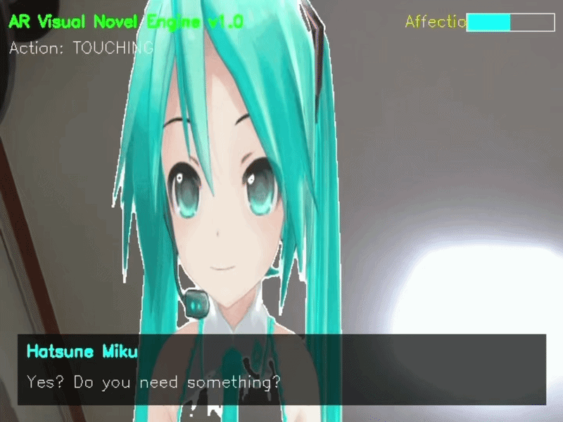
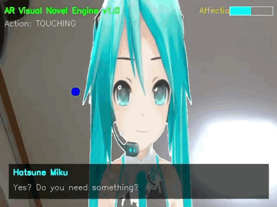
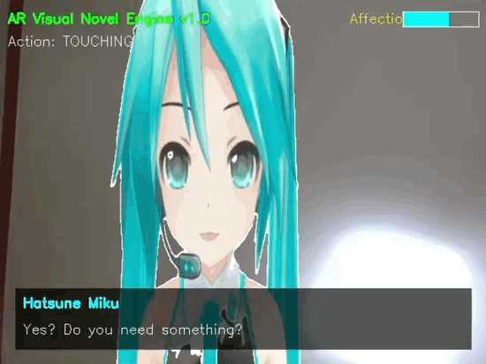

# AR_VisualNovel: Interactive Hand-Gesture Character System

본 프로젝트는 컴퓨터 비전 기술을 활용하여 사용자의 손동작에 따라 캐릭터가 실시간으로 상호작용하는 AR 비주얼 노벨 시스템입니다.

## 1. 프로그램 설명
본 시스템은 웹캠을 통해 사용자의 손동작을 실시간으로 감지합니다. 외부 라이브러리(MediaPipe)의 환경 호환성 문제를 해결하기 위해, OpenCV의 컬러 필터링 및 컨투어 분석 알고리즘을 최적화하여 구현하였습니다. 사용자의 제스처(손바닥 펴기, 움직이기 등)에 따라 캐릭터의 애니메이션과 감정 상태가 실시간으로 변화하며 몰입감 있는 상호작용을 제공합니다.

## 2. 기술 스택 및 사용 API

### 프로그래밍 언어 및 환경
* **Language:** Python 3.x
* **Environment:** Windows 10/11
* **IDE:** VS Code / PyCharm

### 사용된 라이브러리 및 도구
* **OpenCV (cv2):** 실시간 카메라 영상 처리 및 컴퓨터 비전 알고리즘 적용
* **NumPy:** 행렬 연산 및 마스크 데이터 처리를 위한 고속 계산
* **GIF Animation Handling:** 캐릭터 애니메이션 렌더링 및 프레임별 제어
* **UI/UX Implementation:** OpenCV 기반의 실시간 텍스트 및 감정 게이지 렌더링

## 3. 설치 및 실행 방법

### 실행 환경 설정
1. 파이썬(Python 3.8 이상)이 설치되어 있어야 합니다.
2. 터미널(CMD)에서 프로젝트 폴더로 이동합니다.
3. 필수 패키지를 설치합니다:
```bash
   pip install opencv-python numpy

```

### 프로그램 실행

1. 프로젝트 폴더 내에서 다음 명령어를 실행합니다:
```bash
python main.py

```


2. 웹캠 화면이 나타나면 손을 카메라 쪽으로 비추어 상호작용합니다. (종료: 'q' 키 입력)

## 4. 시스템 동작 화면





| 상태 | 동작 조건 | 캐릭터 반응 |
| :--- | :--- | :--- |
| **기본 (Normal)** | 손 인식 전 (정지 상태) | 대기 모드 (Normal) |
| **쓰다듬기 (Patting)** | 손을 화면 위쪽으로 위치함 | 행복함 (Happy) |
| **꼬집기 (Pinching)** | 손을 좌우로 흔들거나 주먹을 쥠 | 화남 (Mad) |

**[이미지 1: 기본 상태에서 대기 중인 캐릭터]**
**[이미지 2: PATTING 시 행복해하는 캐릭터 캡처]**
**[이미지 3: PINCHING 시 화내는 캐릭터 캡처]**

## 5. 참고 자료 및 레퍼런스

* **OpenCV Documentation:** [OpenCV 공식 문서](https://www.google.com/search?q=https://opencv.org/)
* **Computer Vision:** 컬러 필터링을 이용한 객체 추적 알고리즘
* **ChatGPT:** 프로젝트 코드 최적화 및 문서 작성 보조
